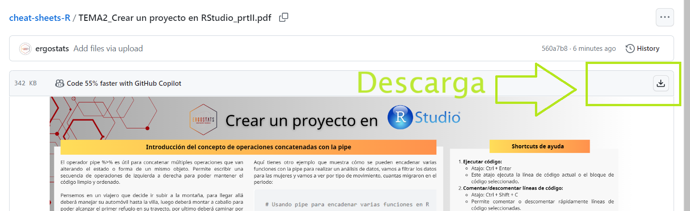

# 📊 Cheatsheets de Análisis de Datos con RStudio

👋 Bienvenidos al repositorio de cheatsheets sobre análisis de datos utilizando RStudio, presentado por el Centro de Investigación Estadística ERGOSTATS. Este esfuerzo está dedicado a aportar al conocimiento y uso eficiente de la herramienta open source R.

💡 **Propósito del Repositorio:**  
En el espíritu del open source, este repositorio ofrece recursos gratuitos para enriquecer la comunidad de R. Creemos firmemente en compartir conocimientos y herramientas que permitan a todos, desde principiantes hasta expertos, mejorar sus habilidades en el análisis de datos. Al proporcionar estos cheatsheets de forma gratuita, buscamos fomentar un ambiente colaborativo y de aprendizaje continuo dentro de la comunidad open source.

## 📝 Cheatsheets Disponibles

| Tema                                        | Enlace de Descarga                                  |
|---------------------------------------------|-----------------------------------------------------|
| Conceptos Básicos para el Análisis de Datos con RStudio | [Descargar](https://github.com/ergostats/cheat-sheets-R/blob/main/TEMA1_Conceptos%20b%C3%A1sicos%20de%20R.pdf) 📥 |
| Creando un Proyecto con Rstudio - Parte I   | [Descargar](https://github.com/ergostats/cheat-sheets-R/blob/main/TEMA2_Crear%20un%20proyecto%20en%20RStudio.pdf) 📥 |
| Creando un Proyecto con Rstudio - Parte II  | [Descargar](https://github.com/ergostats/cheat-sheets-R/blob/main/TEMA2_Crear%20un%20proyecto%20en%20RStudio_prtII.pdf) 📥 |

Da click en el enlace y a continuación tendrás una vista previa de la Chest sheet, para descargar da click en el boton señalado en la siguiente imagen:

## 🤝 ¿Cómo Contribuir?

Si estás interesado en contribuir a esta serie de cheatsheets, por favor envianos un correo a [administracion@ergostats.org](administracion@ergostats.org) con tus dudas y comentarios. Tu apoyo y contribuciones ayudan a mantener vivo el espíritu de la comunidad open source!

## 📜 Licencia

Este proyecto está licenciado bajo la Licencia Creative Commons Atribución 4.0 Internacional (CC BY 4.0). Esto significa que puedes compartir, copiar y redistribuir el material en cualquier medio o formato, y adaptar, remezclar, transformar y construir a partir del material para cualquier propósito, incluso comercialmente, siempre y cuando proporciones el crédito apropiado, proporciones un enlace a la licencia, e indiques si se han realizado cambios.

Puedes ver una copia de esta licencia en [https://creativecommons.org/licenses/by/4.0/](https://creativecommons.org/licenses/by/4.0/).

## ✉️ Contacto

Para más información o consultas, puedes contactar a [Estafanía Tapia](estefaniantm@ergostats.org).

---

🌟 ERGOSTATS | Centro de Investigación Estadística
